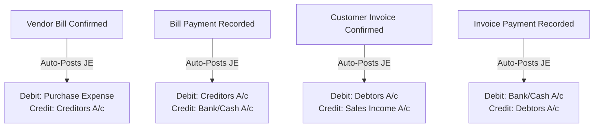
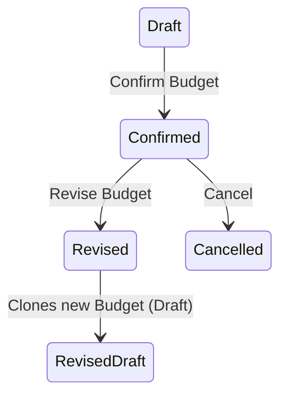

# Urban Furniture Accounting (UrbanFin) - Backend Architecture & Workflow Documentation

This document provides a comprehensive reference for the backend built for the **Urban Furniture Accounting** web application. The backend is built using **Node.js, Express, TypeScript, and MongoDB (Atlas / Mongoose)**.

A core non-negotiable requirement of this project is **zero frontend changes**: all database schemas, API routes, data shapes, field names, response formats, and status codes match the frontend's existing contracts with 100% fidelity.

---

## Table of Contents
1. [System Architecture & Directory Layout](#1-system-architecture--directory-layout)
2. [Data Models & Schema Reference](#2-data-models--schema-reference)
3. [Auto-Numbering Sequences](#3-auto-numbering-sequences)
4. [Double-Entry General Ledger & Auto-Posting Rules](#4-double-entry-general-ledger--auto-posting-rules)
5. [Role-Based Access Control (RBAC) & Security](#5-role-based-access-control-rbac--security)
6. [Customer Portal Scoped Access](#6-customer-portal-scoped-access)
7. [Razorpay Payment Gateway Integration](#7-razorpay-payment-gateway-integration)
8. [Live Financial Reporting & PDF Engine](#8-live-financial-reporting--pdf-engine)
9. [Budget Revision Lifecycle & Analytics](#9-budget-revision-lifecycle--analytics)
10. [In-Memory Caching & Invalidation Matrix](#10-in-memory-caching--invalidation-matrix)
11. [GridFS Image Pipeline & Sharp Compression](#11-gridfs-image-pipeline--sharp-compression)
12. [Complete API Route Inventory](#12-complete-api-route-inventory)
13. [Environment Configuration & Running the System](#13-environment-configuration--running-the-system)
14. [Automated Verification Test Suite](#14-automated-verification-test-suite)

---

## 1. System Architecture & Directory Layout

### Architectural Principles
- **Clean Layered Architecture**: Routes $\rightarrow$ Middlewares (Auth, Validation, Upload) $\rightarrow$ Controllers $\rightarrow$ Services $\rightarrow$ Mongoose Models.
- **Contract Adherence**: IDs transformed to `id` (removing `_id` and `__v` from all JSON responses).
- **Safe Concurrency**: Atomic sequential numbering using MongoDB `findOneAndUpdate` counter models.
- **Fail-Safe Accounting**: Strict live debit = credit balance checks preventing unbalanced postings.

### Backend Directory Structure
```
backend/
├── src/
│   ├── config/
│   │   └── db.ts                   # MongoDB connection & GridFS bucket initialization
│   ├── controllers/
│   │   ├── accountController.ts     # Chart of Accounts CRUD
│   │   ├── analyticController.ts    # Analytic accounts CRUD
│   │   ├── authController.ts        # Login, profile, password change
│   │   ├── budgetController.ts      # Budget CRUD, live math, revision lifecycle
│   │   ├── categoryController.ts    # Product category CRUD
│   │   ├── contactController.ts     # Contacts CRUD
│   │   ├── customerInvoiceController.ts # Customer Invoices, auto-JE, payments
│   │   ├── dashboardController.ts   # Real-time summary KPIs
│   │   ├── imageController.ts       # GridFS upload & stream with sharp compression
│   │   ├── journalController.ts     # Journals CRUD
│   │   ├── journalEntryController.ts# Manual Journal Entries & balance checks
│   │   ├── paymentController.ts     # Internal payments, Razorpay order & verify
│   │   ├── portalController.ts      # Scoped customer portal endpoints
│   │   ├── productController.ts     # Product catalog CRUD
│   │   ├── purchaseOrderController.ts # Purchase Order lifecycle & create-bill
│   │   ├── reportController.ts      # P&L, Balance sheet, and PDF streams
│   │   └── salesOrderController.ts  # Sales Order lifecycle & create-invoice
│   ├── middleware/
│   │   ├── auth.ts                  # JWT authentication & requireRole / requirePortalAccess
│   │   └── errorHandler.ts          # Centralized error handler & route 404 handler
│   ├── models/                      # 15 Mongoose Schemas & Models
│   │   ├── Account.ts
│   │   ├── AnalyticAccount.ts
│   │   ├── Budget.ts
│   │   ├── Category.ts
│   │   ├── Contact.ts
│   │   ├── CustomerInvoice.ts
│   │   ├── Journal.ts
│   │   ├── JournalEntry.ts
│   │   ├── Payment.ts
│   │   ├── PaymentTerm.ts
│   │   ├── Product.ts
│   │   ├── PurchaseOrder.ts
│   │   ├── SalesOrder.ts
│   │   ├── SequenceCounter.ts
│   │   ├── User.ts
│   │   └── VendorBill.ts
│   ├── routes/                      # Express route definitions
│   │   ├── accountRoutes.ts
│   │   ├── analyticRoutes.ts
│   │   ├── authRoutes.ts
│   │   ├── budgetRoutes.ts
│   │   ├── categoryRoutes.ts
│   │   ├── contactRoutes.ts
│   │   ├── customerInvoiceRoutes.ts
│   │   ├── dashboardRoutes.ts
│   │   ├── imageRoutes.ts
│   │   ├── journalEntryRoutes.ts
│   │   ├── journalRoutes.ts
│   │   ├── paymentRoutes.ts
│   │   ├── portalRoutes.ts
│   │   ├── productRoutes.ts
│   │   ├── purchaseOrderRoutes.ts
│   │   ├── reportRoutes.ts
│   │   ├── salesOrderRoutes.ts
│   │   └── vendorBillRoutes.ts
│   ├── services/                    # Business logic and cross-model orchestration
│   │   ├── budgetService.ts         # Live budget achieved calculation & revision
│   │   ├── journalEntryService.ts   # Double-entry creation & balance validation
│   │   ├── pdfService.ts            # Dynamic PDF generation using pdfkit
│   │   ├── reportService.ts         # Live calculation of P&L and Balance Sheet
│   │   └── sequenceService.ts       # Atomic document counter generation
│   ├── test/
│   │   └── verify.ts                # 12-stage cross-module integration test suite
│   ├── types/
│   │   └── index.ts                 # Full TypeScript types matching frontend models
│   ├── utils/
│   │   ├── cache.ts                 # In-memory TTL cache with multi-key invalidation
│   │   └── validation.ts            # Password regex & loginId validation rules
│   ├── app.ts                       # Express app configuration & middleware mounts
│   ├── seed.ts                      # Idempotent database seeder
│   └── server.ts                    # HTTP server startup entrypoint
├── package.json
├── tsconfig.json
└── .env.example
```

---

## 2. Data Models & Schema Reference

All models are built with Mongoose and include automatic timestamping (`createdAt`, `updatedAt`) and JSON transforms that remap `_id` $\rightarrow$ `id` while omitting internal `__v` and password hashes.

### 1. User (`users` collection)
- `name` (String, required, min 3 chars, trim)
- `loginId` (String, required, unique, 6–12 chars, no spaces)
- `email` (String, required, unique, validated email format)
- `password` (String, hashed using bcrypt, min 8 chars with uppercase, lowercase, digit, special character)
- `role` (`Administrator` | `Accountant` | `User`, required)
- `contactId` (String, optional ObjectId reference to Contact for portal users)

### 2. Contact (`contacts` collection)
- `name` (String, required, trim)
- `type` (`Customer` | `Vendor` | `Both`, required)
- `email` (String, required)
- `phone` (String, required)
- `image` (String, optional GridFS image ID or URL)
- `address` (Subdocument: `street`, `city`, `state`, `zip`, `country`)
- `hasPortalAccess` (Boolean, default `false`)

### 3. Category (`categories` collection)
- `name` (String, required, unique, trim)

### 4. Product (`products` collection)
- `name` (String, required, trim)
- `type` (`Goods` | `Service` | `Combo`, required)
- `categoryId` (String, required, ref Category)
- `salesPrice` (Number, required, min 0)
- `cost` (Number, required, min 0)
- `image` (String, optional GridFS image ID or URL)

### 5. Account (`accounts` collection - Chart of Accounts)
- `name` (String, required, unique, trim)
- `type` (`Asset` | `Liability` | `Bank` | `Capital` | `Cash` | `Income` | `Expenses` | `Other Expenses`)

### 6. Journal (`journals` collection)
- `name` (String, required, unique, trim)
- `type` (`Sales` | `Purchase` | `Bank` | `Cash`, required)
- `defaultAccountId` (String, required, ref Account)

### 7. Journal Entry (`journalentries` collection)
- `date` (String `YYYY-MM-DD`, required)
- `number` (String, unique, format `JRNL/YYYY/0001` or `Bill/...` / `INV/...`)
- `journalId` (String, required, ref Journal)
- `partnerId` (String, optional ref Contact)
- `status` (`Draft` | `Posted`, required)
- `lines` (Array of subdocuments: `accountId`, `partnerId`, `debit`, `credit`)
- `total` (Number, computed sum of debits)
- `sourceDocument` (Optional polymorphic ref: `model: 'VendorBill' | 'CustomerInvoice'`, `id: String`)

### 8. Analytic Account (`analyticaccounts` collection)
- `name` (String, required, unique, trim)
- `code` (String, required, unique, trim)
- `type` (`Income` | `Expenses`, required)

### 9. Budget (`budgets` collection)
- `name` (String, required, trim)
- `startDate` (String `YYYY-MM-DD`, required)
- `endDate` (String `YYYY-MM-DD`, required)
- `status` (`Draft` | `Confirmed` | `Revised` | `Cancelled`, required)
- `lines` (Array: `analyticAccountId`, `type`, `committedAmount`, `achievedAmount`)
- `parentBudgetId` (String, optional ref Budget)
- `revisedBudgetId` (String, optional ref Budget)

### 10. Purchase Order (`purchaseorders` collection)
- `number` (String, unique, format `P00001`)
- `vendorId` (String, required, ref Contact)
- `date` (String `YYYY-MM-DD`, required)
- `status` (`Draft` | `Confirmed` | `Billed` | `Cancelled`, default `Draft`)
- `lines` (Array: `productId`, `qty`, `unitPrice`, `subtotal`)
- `total` (Number, computed sum of line subtotals)
- `vendorBillId` (String, optional ref VendorBill)

### 11. Vendor Bill (`vendorbills` collection)
- `number` (String, unique, format `Bill/YYYY/0001`)
- `vendorId` (String, required, ref Contact)
- `billDate` (String `YYYY-MM-DD`, required)
- `dueDate` (String `YYYY-MM-DD`, required)
- `billReference` (String, optional)
- `purchaseOrderId` (String, optional ref PurchaseOrder)
- `status` (`Draft` | `Confirmed` | `Paid` | `Partially Paid` | `Cancelled`, default `Draft`)
- `paymentTermId` (String, optional)
- `lines` (Array: `productId`, `accountId`, `qty`, `unitPrice`, `subtotal`, `analyticAccountId`)
- `amountPaid` (Number, default 0)
- `cashPaid` (Number, default 0)
- `bankPaid` (Number, default 0)
- `total` (Number, computed sum of line subtotals)
- `amountDue` (Number, computed as `total - amountPaid`)

### 12. Sales Order (`salesorders` collection)
- `number` (String, unique, format `S00001`)
- `customerId` (String, required, ref Contact)
- `date` (String `YYYY-MM-DD`, required)
- `status` (`Draft` | `Confirmed` | `Invoiced` | `Cancelled`, default `Draft`)
- `lines` (Array: `productId`, `qty`, `unitPrice`, `subtotal`)
- `total` (Number, computed sum of line subtotals)
- `customerInvoiceId` (String, optional ref CustomerInvoice)

### 13. Customer Invoice (`customerinvoices` collection)
- `number` (String, unique, format `INV/YYYY/0001`)
- `customerId` (String, required, ref Contact)
- `invoiceDate` (String `YYYY-MM-DD`, required)
- `dueDate` (String `YYYY-MM-DD`, required)
- `invoiceReference` (String, optional)
- `salesOrderId` (String, optional ref SalesOrder)
- `status` (`Draft` | `Confirmed` | `Paid` | `Partially Paid` | `Cancelled`, default `Draft`)
- `paymentTermId` (String, optional)
- `lines` (Array: `productId`, `accountId`, `qty`, `unitPrice`, `subtotal`, `analyticAccountId`)
- `amountPaid` (Number, default 0)
- `cashPaid` (Number, default 0)
- `bankPaid` (Number, default 0)
- `total` (Number, computed sum of line subtotals)
- `amountDue` (Number, computed as `total - amountPaid`)

### 14. Payment (`payments` collection)
- `date` (String `YYYY-MM-DD`, required)
- `partnerId` (String, required, ref Contact)
- `journalId` (String, required, ref Journal)
- `paymentType` (`Send` | `Receive`, required)
- `amount` (Number, required, min > 0)
- `paymentMethod` (`Cash` | `Bank` | `Razorpay`, required)
- `documentType` (`VendorBill` | `CustomerInvoice`, required)
- `documentId` (String, required)
- `razorpayOrderId` (String, optional)
- `razorpayPaymentId` (String, optional)

### 15. SequenceCounter (`sequencecounters` collection)
- `key` (String, required, unique - e.g., `PO`, `SO`, `BILL_2026`, `INV_2026`, `JRNL_2026`)
- `seq` (Number, required, atomic increment)

---

## 3. Auto-Numbering Sequences

The backend manages atomic sequential numbering via `sequenceService.ts` using MongoDB's atomic `findOneAndUpdate({ key }, { $inc: { seq: 1 } }, { upsert: true, new: true })`.

| Document Type | Prefix / Pattern | Counter Key | Example |
| :--- | :--- | :--- | :--- |
| **Purchase Order** | `P` + 5 digits | `PO` | `P00001`, `P00002` |
| **Sales Order** | `S` + 5 digits | `SO` | `S00001`, `S00002` |
| **Vendor Bill** | `Bill/YYYY/` + 4 digits | `BILL_YYYY` | `Bill/2026/0001` |
| **Customer Invoice** | `INV/YYYY/` + 4 digits | `INV_YYYY` | `INV/2026/0001` |
| **Journal Entry** | `JRNL/YYYY/` + 4 digits | `JRNL_YYYY` | `JRNL/2026/0001` |

---

## 4. Double-Entry General Ledger & Auto-Posting Rules

### Balancing Rule
Every Journal Entry posted directly or generated by document confirmation must satisfy:
$$\sum \text{Debit} = \sum \text{Credit} > 0$$
Any attempt to save or post an entry where $\sum \text{Debit} \neq \sum \text{Credit}$ is rejected with HTTP `400 Bad Request`.

### Automated Ledger Posting Rules



1. **Vendor Bill Confirmation** (`POST /api/vendor-bills/:id/confirm`):
   - **Debit**: Purchase Expense A/c (or individual line expense accounts) for the line total.
   - **Credit**: Creditors A/c for the total bill amount.
   - Linked to the Purchase Journal with `partnerId = vendorId` and `sourceDocument = { model: 'VendorBill', id: bill.id }`.

2. **Customer Invoice Confirmation** (`POST /api/customer-invoices/:id/confirm`):
   - **Debit**: Debtors A/c for the total invoice amount.
   - **Credit**: Sales Income A/c (or individual line sales accounts) for the line total.
   - Linked to the Sales Journal with `partnerId = customerId` and `sourceDocument = { model: 'CustomerInvoice', id: invoice.id }`.

3. **Bill Payment Recording** (`POST /api/payments`):
   - Updates `amountPaid`, `cashPaid`, `bankPaid`, and `amountDue` on the Vendor Bill.
   - Status transitions to `Paid` if `amountDue <= 0`, or `Partially Paid` if `amountPaid > 0`.
   - **Debit**: Creditors A/c for payment amount.
   - **Credit**: Bank A/c or Cash A/c based on Journal type.

4. **Invoice Payment Recording / Razorpay Capture**:
   - Updates `amountPaid`, `cashPaid`, `bankPaid`, and `amountDue` on the Customer Invoice.
   - Status transitions to `Paid` if `amountDue <= 0`, or `Partially Paid`.
   - **Debit**: Bank A/c or Cash A/c.
   - **Credit**: Debtors A/c.

---

## 5. Role-Based Access Control (RBAC) & Security

The system enforces 3 distinct roles in `src/middleware/auth.ts`:
1. **`Administrator`**: Complete access to all routes, including Chart of Accounts creation, user management, and all financial operations.
2. **`Accountant`**: Access to full accounting, sales, purchase, journals, budgets, and financial reporting. Restricted from creating new Chart of Accounts entries (read-only on accounts) and managing internal user accounts.
3. **`User` (Customer)**: Restricted strictly to customer portal endpoints (`/api/portal/*`). All internal sales, purchases, journals, accounts, and admin endpoints return `403 Forbidden`.

### Password Policy Validation
- Enforced at server-side during registration and password change:
  - Minimum 8 characters.
  - At least 1 uppercase letter (`[A-Z]`).
  - At least 1 lowercase letter (`[a-z]`).
  - At least 1 number (`[0-9]`).
  - At least 1 special character (`[!@#$%^&*(),.?":{}|<>]`).
- `loginId`: Validated to 6–12 alphanumeric characters with no spaces.

---

## 6. Customer Portal Scoped Access

When a user with the `User` role logs in, their JWT payload contains `userId`, `role: 'User'`, and `contactId`.

1. **`GET /api/portal/invoices`**:
   - Queries `CustomerInvoice.find({ customerId: req.user.contactId })`.
   - Never exposes any invoices belonging to other contacts.
   - Returns array of: `{ id, number, invoiceDate, dueDate, total, amountPaid, amountDue, status }`.
2. **`GET /api/portal/invoices/:id`**:
   - Ensures the requested invoice ID matches `customerId === req.user.contactId`. Returns 404/403 if mismatched.
3. **`POST /api/portal/invoices/:id/pay`**:
   - Direct payment capture / checkout for the customer's own invoices.

---

## 7. Razorpay Payment Gateway Integration

The backend supports full end-to-end Razorpay order creation and HMAC-SHA256 signature verification.

### Environment Variables
- `NEXT_PUBLIC_RAZORPAY_KEY_ID`: Client public key.
- `RAZORPAY_KEY_SECRET`: Secret key used for cryptographic signature verification.
- `REZERPAY_API_KEY`: Fallback key compatibility for existing client code.

### Endpoints
1. **Create Order** (`POST /api/payments/create-order`):
   - Accepts `{ invoiceId?: string, billId?: string, amount: number, currency: 'INR' }`.
   - Calculates amount in paise (`amount * 100`).
   - Returns `{ orderId: 'order_xxx', amount, currency: 'INR', key: '...' }`.
2. **Verify Payment** (`POST /api/payments/verify`):
   - Accepts `{ razorpay_order_id, razorpay_payment_id, razorpay_signature, invoiceId?, billId?, amount }`.
   - Validates cryptographic signature:
     $$\text{HMAC-SHA256}(\text{order\_id} + "|" + \text{payment\_id}, \text{RAZORPAY\_KEY\_SECRET}) == \text{razorpay\_signature}$$
   - On successful verification:
     - Creates a `Payment` record with method `Razorpay`.
     - Updates target `CustomerInvoice` or `VendorBill` (`amountPaid += amount`, `bankPaid += amount`, updates status to `Paid` or `Partially Paid`).
     - Auto-posts corresponding balancing Journal Entry into the General Ledger.

---

## 8. Live Financial Reporting & PDF Engine

### Profit & Loss Report (`GET /api/reports/profit-loss?year=YYYY`)
- Aggregates all Posted journal entries within the target year:
  - **Operating Income**: Total credits to Income accounts.
  - **Cost of Goods Sold / Expenses**: Total debits to Expense accounts.
  - **Gross Profit**: $\text{Income} - \text{Operating Expenses}$.
  - **Other Expenses**: Total debits to Other Expense accounts.
  - **Net Profit**: $\text{Gross Profit} - \text{Other Expenses}$.

### Balance Sheet Report (`GET /api/reports/balance-sheet?year=YYYY`)
- Aggregates all Posted journal entries up to the year end:
  - **Assets**: Debit balances of Cash, Bank, and Asset (Debtors) accounts.
  - **Liabilities**: Credit balances of Liability (Creditors) accounts.
  - **Equity / Capital**: Capital accounts + Current Year Net Profit.
  - **Balancing Check**: $\text{Total Assets} = \text{Total Liabilities} + \text{Total Equity}$.
  - `isBalanced: boolean` returned in the response object.

### Server-Side PDF Generation (`pdfkit`)
- `GET /api/reports/profit-loss/pdf?year=YYYY`: Streams clean, formatted PDF with table of accounts, subtotals, and Net Profit.
- `GET /api/reports/balance-sheet/pdf?year=YYYY`: Streams formatted PDF with Assets, Liabilities, Equity, and Balanced check indicator.

---

## 9. Budget Revision Lifecycle & Analytics

### Analytic Accounts
- Categorize revenue and expenses into cost centers (`Income` or `Expenses`).

### Live Achieved Calculation
- When fetching budgets (`GET /api/budgets`), the system aggregates confirmed Vendor Bills and Customer Invoices whose lines reference the budget's `analyticAccountId` within the date range `[startDate, endDate]`.

### Revision Lifecycle

- Calling `POST /api/budgets/:id/revise`:
  1. Sets original budget status to `Revised`.
  2. Clones the budget with status `Draft`, incrementing name (e.g. `January 2026 (Rev 1)`).
  3. Sets `parentBudgetId` on the new draft and `revisedBudgetId` on the original.

---

## 10. In-Memory Caching & Invalidation Matrix

A lightweight, high-performance in-memory cache (`src/utils/cache.ts`) minimizes database load for read-heavy operations.

| Cache Key Prefix | Cached Endpoints | Invalidation Triggers |
| :--- | :--- | :--- |
| `contacts:` | `GET /api/contacts`, `GET /api/contacts/:id` | Contact Create, Update, Delete |
| `products:` | `GET /api/products`, `GET /api/products/:id` | Product Create, Update, Delete |
| `categories:` | `GET /api/categories` | Category Create, Update, Delete |
| `accounts:` | `GET /api/accounts`, `GET /api/accounts/:id` | Account Create, Update |
| `journals:` | `GET /api/journals`, `GET /api/journals/:id` | Journal Create, Update |
| `journal_entries:` | `GET /api/journal-entries`, `GET /api/journal-entries/:id` | JE Create, Update, Confirm Bill/Invoice, Payments |
| `budgets:` | `GET /api/budgets`, `GET /api/budgets/:id` | Budget Create, Update, Revise, Bill/Invoice Confirm |
| `reports:` | `GET /api/reports/profit-loss`, `balance-sheet` | Any Journal Entry post, Bill/Invoice confirm, Payment |
| `dashboard:` | `GET /api/dashboard/summary` | Any Sales, Purchase, Invoice, Bill, Payment mutation |

---

## 11. GridFS Image Pipeline & Sharp Compression

- **Upload Endpoint**: `POST /api/images/upload` (multipart `file` field).
- **Processing**: Using `sharp`, uploaded images are resized to a maximum bounding box of $1200\times 1200\text{px}$ preserving aspect ratio, converted to WebP with quality 75.
- **Storage**: Streamed directly to MongoDB GridFS in the `images` bucket.
- **Retrieval**: `GET /api/images/:id` streams the image chunk directly with `Content-Type: image/webp` and browser caching headers (`Cache-Control: public, max-age=31536000, immutable`).

---

## 12. Complete API Route Inventory

### Authentication & Users (`/api/auth`)
| Method | Endpoint | Auth | Role | Description |
| :--- | :--- | :--- | :--- | :--- |
| `POST` | `/api/auth/register` | None | Public | Register new user (Administrator/Accountant/User) |
| `POST` | `/api/auth/login` | None | Public | Authenticate and receive JWT token + user profile |
| `GET` | `/api/auth/me` | Bearer | Any | Get currently authenticated user profile |
| `POST` | `/api/auth/change-password`| Bearer | Any | Change password with strict regex validation |
| `GET` | `/api/auth/users` | Bearer | Administrator | List all registered users |

### Contacts (`/api/contacts`)
| Method | Endpoint | Auth | Role | Description |
| :--- | :--- | :--- | :--- | :--- |
| `GET` | `/api/contacts` | Bearer | Admin, Accountant | List contacts (supports `?type=`, `?search=`) |
| `GET` | `/api/contacts/:id` | Bearer | Admin, Accountant | Get contact by ID |
| `POST` | `/api/contacts` | Bearer | Admin, Accountant | Create new contact |
| `PUT` | `/api/contacts/:id` | Bearer | Admin, Accountant | Update existing contact |
| `DELETE`| `/api/contacts/:id` | Bearer | Administrator | Delete contact |

### Products & Categories (`/api/products`, `/api/categories`)
| Method | Endpoint | Auth | Role | Description |
| :--- | :--- | :--- | :--- | :--- |
| `GET` | `/api/products` | Bearer | Admin, Accountant | List products (supports `?category=`, `?search=`) |
| `GET` | `/api/products/:id` | Bearer | Admin, Accountant | Get product by ID |
| `POST` | `/api/products` | Bearer | Admin, Accountant | Create new product |
| `PUT` | `/api/products/:id` | Bearer | Admin, Accountant | Update product |
| `DELETE`| `/api/products/:id` | Bearer | Administrator | Delete product |
| `GET` | `/api/categories` | Bearer | Admin, Accountant | List product categories |
| `POST` | `/api/categories` | Bearer | Admin, Accountant | Create product category |

### Chart of Accounts & Journals (`/api/accounts`, `/api/journals`)
| Method | Endpoint | Auth | Role | Description |
| :--- | :--- | :--- | :--- | :--- |
| `GET` | `/api/accounts` | Bearer | Admin, Accountant | List 8 core accounts + added accounts |
| `POST` | `/api/accounts` | Bearer | Administrator | Add account to Chart of Accounts |
| `GET` | `/api/journals` | Bearer | Admin, Accountant | List journals (Sales, Purchase, Bank, Cash) |
| `POST` | `/api/journals` | Bearer | Administrator | Create custom journal |

### Journal Entries (`/api/journal-entries`)
| Method | Endpoint | Auth | Role | Description |
| :--- | :--- | :--- | :--- | :--- |
| `GET` | `/api/journal-entries` | Bearer | Admin, Accountant | List journal entries (`?journalId=`, `?status=`) |
| `GET` | `/api/journal-entries/:id` | Bearer | Admin, Accountant | Get journal entry details |
| `POST` | `/api/journal-entries` | Bearer | Admin, Accountant | Create manual entry (live debit=credit balance enforced) |
| `PUT` | `/api/journal-entries/:id` | Bearer | Admin, Accountant | Update journal entry |
| `POST` | `/api/journal-entries/:id/post` | Bearer | Admin, Accountant | Post draft journal entry to General Ledger |

### Purchase Orders & Vendor Bills (`/api/purchase-orders`, `/api/vendor-bills`)
| Method | Endpoint | Auth | Role | Description |
| :--- | :--- | :--- | :--- | :--- |
| `GET` | `/api/purchase-orders` | Bearer | Admin, Accountant | List purchase orders |
| `POST` | `/api/purchase-orders` | Bearer | Admin, Accountant | Create purchase order (auto `P00001`) |
| `POST` | `/api/purchase-orders/:id/confirm` | Bearer | Admin, Accountant | Confirm purchase order |
| `POST` | `/api/purchase-orders/:id/create-bill` | Bearer | Admin, Accountant | Create draft Vendor Bill from PO |
| `GET` | `/api/vendor-bills` | Bearer | Admin, Accountant | List vendor bills |
| `POST` | `/api/vendor-bills` | Bearer | Admin, Accountant | Create direct vendor bill |
| `POST` | `/api/vendor-bills/:id/confirm` | Bearer | Admin, Accountant | Confirm bill & auto-post balancing Journal Entry |

### Sales Orders & Customer Invoices (`/api/sales-orders`, `/api/customer-invoices`)
| Method | Endpoint | Auth | Role | Description |
| :--- | :--- | :--- | :--- | :--- |
| `GET` | `/api/sales-orders` | Bearer | Admin, Accountant | List sales orders |
| `POST` | `/api/sales-orders` | Bearer | Admin, Accountant | Create sales order (auto `S00001`) |
| `POST` | `/api/sales-orders/:id/confirm` | Bearer | Admin, Accountant | Confirm sales order |
| `POST` | `/api/sales-orders/:id/create-invoice`| Bearer | Admin, Accountant | Create draft Customer Invoice from SO |
| `GET` | `/api/customer-invoices` | Bearer | Admin, Accountant | List customer invoices |
| `POST` | `/api/customer-invoices` | Bearer | Admin, Accountant | Create direct customer invoice |
| `POST` | `/api/customer-invoices/:id/confirm` | Bearer | Admin, Accountant | Confirm invoice & auto-post balancing Journal Entry |

### Payments & Razorpay (`/api/payments`)
| Method | Endpoint | Auth | Role | Description |
| :--- | :--- | :--- | :--- | :--- |
| `GET` | `/api/payments` | Bearer | Admin, Accountant | List recorded payments |
| `POST` | `/api/payments` | Bearer | Admin, Accountant | Record manual Cash/Bank payment on Bill/Invoice |
| `POST` | `/api/payments/create-order` | Bearer | Any | Create Razorpay order (paise calculation) |
| `POST` | `/api/payments/verify` | Bearer | Any | Verify Razorpay HMAC signature & update document |

### Customer Portal (`/api/portal`)
| Method | Endpoint | Auth | Role | Description |
| :--- | :--- | :--- | :--- | :--- |
| `GET` | `/api/portal/invoices` | Bearer | User (Customer) | List scoped invoices for logged-in contact |
| `GET` | `/api/portal/invoices/:id` | Bearer | User (Customer) | Get invoice details for logged-in contact |
| `POST` | `/api/portal/invoices/:id/pay` | Bearer | User (Customer) | Pay scoped invoice |

### Analytic Accounts & Budgets (`/api/analytics`, `/api/budgets`)
| Method | Endpoint | Auth | Role | Description |
| :--- | :--- | :--- | :--- | :--- |
| `GET` | `/api/analytics` | Bearer | Admin, Accountant | List analytic accounts |
| `POST` | `/api/analytics` | Bearer | Admin, Accountant | Create analytic account |
| `GET` | `/api/budgets` | Bearer | Admin, Accountant | List budgets with live achieved amounts |
| `POST` | `/api/budgets` | Bearer | Admin, Accountant | Create new budget |
| `POST` | `/api/budgets/:id/confirm` | Bearer | Admin, Accountant | Confirm budget |
| `POST` | `/api/budgets/:id/revise` | Bearer | Admin, Accountant | Revise budget (clones into new linked revision) |
| `GET` | `/api/budgets/matching-transactions`| Bearer| Admin, Accountant| Drill down matching transactions for budget line |

### Financial Reports & Dashboard (`/api/reports`, `/api/dashboard`)
| Method | Endpoint | Auth | Role | Description |
| :--- | :--- | :--- | :--- | :--- |
| `GET` | `/api/reports/profit-loss` | Bearer | Admin, Accountant | Live Profit & Loss statement |
| `GET` | `/api/reports/balance-sheet` | Bearer | Admin, Accountant | Live Balance Sheet with `isBalanced` |
| `GET` | `/api/reports/profit-loss/pdf` | Bearer | Admin, Accountant | Download P&L as PDF |
| `GET` | `/api/reports/balance-sheet/pdf` | Bearer | Admin, Accountant | Download Balance Sheet as PDF |
| `GET` | `/api/dashboard/summary` | Bearer | Admin, Accountant | Real-time financial summary KPI metrics |

### Images & Health
| Method | Endpoint | Auth | Role | Description |
| :--- | :--- | :--- | :--- | :--- |
| `POST` | `/api/images/upload` | Bearer | Admin, Accountant | Upload image to GridFS (Sharp compressed WebP) |
| `GET` | `/api/images/:id` | None | Public | Stream image from GridFS |
| `GET` | `/api/health` | None | Public | System status and database health check |

---

## 13. Environment Configuration & Running the System

### Environment Variables (`backend/.env`)
```env
PORT=5000
NODE_ENV=development
MONGODB_URI=mongodb://127.0.0.1:27017/urbanfin
JWT_SECRET=urbanfin_jwt_secret_key_2026_super_secure_key_12345
JWT_EXPIRES_IN=7d

# Razorpay Configuration
NEXT_PUBLIC_RAZORPAY_KEY_ID=rzp_test_urbanfin2026
RAZORPAY_KEY_SECRET=rzp_secret_urbanfin_test_2026
REZERPAY_API_KEY=rzp_test_urbanfin2026
```

### Commands
```bash
# Navigate to backend
cd backend

# Install dependencies
npm install

# Seed the database with initial demo data (accounts, journals, products, demo users)
npm run seed

# Start development server with live reload
npm run dev

# Run full cross-module verification test suite
npm test

# Build production bundle
npm run build

# Start production server
npm start
```

---

## 14. Automated Verification Test Suite

The backend includes a comprehensive 12-stage integration test suite located at `backend/src/test/verify.ts`. It runs an in-memory MongoDB server (`mongodb-memory-server`) to perform end-to-end HTTP validation across all modules without polluting live databases.

### Verification Stages Tested
1. **Healthcheck**: Validates server availability and MongoDB connection state.
2. **Auth & RBAC**: Logs in Admin, Accountant, and Customer; validates JWT tokens and role claims.
3. **Chart of Accounts & Journals**: Confirms all 8 core accounts and 4 core journals are seeded and queryable.
4. **Journal Entry Balance Enforcement**: Proves that unbalanced entries ($\text{Debit} \neq \text{Credit}$) are rejected with `400 Bad Request`, and balanced entries succeed.
5. **Purchase Lifecycle**: Creates `PO` $\rightarrow$ Confirms $\rightarrow$ Creates `VendorBill` $\rightarrow$ Confirms (auto-posting balancing JE to Creditors and Purchase Expense) $\rightarrow$ Records Bill Payment.
6. **Sales Lifecycle**: Creates `SO` $\rightarrow$ Confirms $\rightarrow$ Creates `CustomerInvoice` $\rightarrow$ Confirms (auto-posting balancing JE to Debtors and Sales Income).
7. **Customer Portal Isolation**: Confirms `User`-role tokens can ONLY view their own linked contact's invoices and receive `403 Forbidden` on internal journal routes.
8. **Razorpay Integration**: Creates order and verifies HMAC SHA256 payment signature, verifying invoice status updates to `Paid`.
9. **Budget Revision Lifecycle**: Calculates live achieved amounts from bills/invoices, confirms budget, and executes revision cloning.
10. **Financial Reports & PDF**: Computes live P&L and Balance Sheet; validates `isBalanced: true` and streams valid binary PDF buffers.
11. **Dashboard KPIs**: Verifies real-time calculation of total revenue, receivables, payables, and net profit.
12. **GridFS & Sharp Pipeline**: Uploads sample image, compresses to WebP, stores in GridFS, and streams it back.
